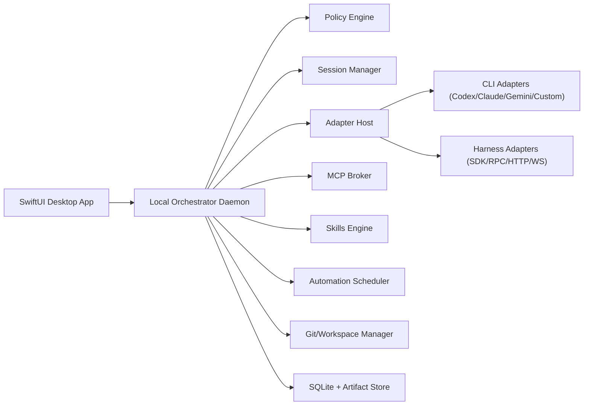

# Universal Coding Agent Desktop (macOS) - Comprehensive Design Doc

Date: February 24, 2026  
Status: Draft v1  
Owner: Product + Platform Engineering

## 1. Objective

Build a standalone macOS app that provides one consistent coding workflow across:

- Codex (CLI and API-backed harnesses)
- Claude Code (CLI) and Claude SDK-backed harnesses
- Gemini CLI
- Any custom CLI
- Any custom harness (local or remote)

The app must make multi-session workflows, session forking, permission control, skills, and MCP first-class and consistent regardless of provider.

## 2. Product Vision

Users should experience this as a local "coding OS":

- Start many agent sessions in parallel.
- Fork sessions quickly and safely.
- Enforce strict permissions with auditable approvals.
- Reuse skills and MCP tools across providers.
- Keep work reproducible through event logs, snapshots, and Git-native workflows.

## 3. Non-Goals (v1)

- Building a model provider ourselves.
- Guaranteeing feature parity for every third-party adapter from day one.
- Cloud sync and multi-user collaboration as a hard requirement for initial launch.
- Replacing users' IDEs.

## 4. Core Principles

- Adapter-first: provider integrations are plugins, not product branches.
- Local-first: core workflows must work fully on-device.
- Policy-first: permissions are enforced by our platform, not delegated to providers.
- Replayable state: every run is reconstructable from events + artifacts.
- Graceful degradation: weak adapters still work with reduced feature set.

## 5. Primary User Scenarios

- A developer runs 5-10 concurrent tasks across monorepo services.
- A user forks a session before risky edits and compares outcomes.
- A team uses shared skills and MCP servers across Codex/Claude/Gemini sessions.
- A user runs recurring automations with strict workspace/network controls.
- A power user connects a custom harness while preserving the same UI/policy model.

## 6. High-Level Architecture



## 7. Process Model

- `App UI Process` (SwiftUI):
  - Session tree, thread view, diff/review pane, permissions center, settings.
- `Orchestrator Process` (Rust preferred):
  - Runs core state machine, policy checks, adapter lifecycle, event routing.
- `Runner Worker Processes`:
  - Isolated command/tool execution per session.
- `MCP Broker Process`:
  - Owns MCP connections, auth, tool/resource mediation.

Rationale:

- Strong crash isolation.
- Clear security boundaries.
- Better performance for many parallel sessions.

## 8. Adapter Platform

### 8.1 Adapter Types

- `CliAdapter`: PTY/stdio wrapper for command-line agents.
  - Examples: Codex CLI, Claude Code CLI, Gemini CLI, custom CLIs.
- `HarnessAdapter`: structured transport (JSON-RPC/HTTP/WebSocket/SDK bridge).
  - Examples: Claude SDK harness, OpenAI-backed harness, internal custom agents.

### 8.2 Adapter Interface (Canonical)

```ts
type AdapterKind = "cli" | "harness";

interface AgentAdapter {
  metadata(): {
    id: string;
    name: string;
    version?: string;
    kind: AdapterKind;
  };

  capabilities(): {
    structuredEvents: boolean;
    structuredTools: boolean;
    supportsForkHints: boolean;
    supportsResume: boolean;
    supportsInterrupt: boolean;
    supportsPatch: boolean;
    supportsMcpPassthrough: boolean;
  };

  start(session: StartSessionRequest): Promise<void>;
  sendTurn(turn: UserTurn): Promise<void>;
  interrupt(sessionId: string): Promise<void>;
  resume(sessionId: string): Promise<void>;
  stop(sessionId: string): Promise<void>;
  streamEvents(sessionId: string): AsyncIterable<AdapterEvent>;
}
```

### 8.3 Compatibility Tiers

- Tier 1: Structured tool calls + patch metadata + rich events.
- Tier 2: Reliable text parsing + command and patch detection.
- Tier 3: Raw chat stream only.

The UI gates features by negotiated capabilities.

## 9. Provider Coverage (Explicit)

### 9.1 Codex

- `CodexCliAdapter`: PTY integration.
- `CodexHarnessAdapter`: API/harness mode where available.

### 9.2 Claude

- `ClaudeCodeCliAdapter`: Claude Code CLI.
- `ClaudeSdkHarnessAdapter`: SDK-backed custom harness.

### 9.3 Gemini

- `GeminiCliAdapter`: Gemini CLI via PTY.

### 9.4 Custom

- `GenericCliAdapter`: adapter templates + parser hooks.
- `GenericHarnessAdapter`: JSON-RPC contract for custom orchestrators.

## 10. Unified Event Model

All adapters normalize into one event schema:

- `assistant_message`
- `reasoning_summary` (optional, provider-dependent)
- `tool_call_requested`
- `tool_call_result`
- `command_started`
- `command_output`
- `command_finished`
- `file_patch_proposed`
- `file_patch_applied`
- `permission_requested`
- `permission_resolved`
- `session_state_changed`
- `error`

Core envelope:

```json
{
  "event_id": "uuid",
  "session_id": "uuid",
  "timestamp": "2026-02-24T18:00:00Z",
  "source": {
    "adapter_id": "codex-cli",
    "provider": "openai"
  },
  "type": "command_started",
  "payload": {}
}
```

## 11. Session and Fork Model

### 11.1 Session Graph

- Sessions form a DAG with parent pointers.
- Fork creates a child session inheriting:
  - Prompt context snapshot.
  - Workspace snapshot/worktree reference.
  - Selected adapter + mode + policy profile.

### 11.2 Session States

- `CREATED`
- `RUNNING`
- `WAITING_FOR_APPROVAL`
- `INTERRUPTED`
- `COMPLETED`
- `FAILED`
- `ARCHIVED`

### 11.3 Fork Semantics

- Fork is platform-level, not provider-dependent.
- Providers may expose native cloning; this is an optimization only.

## 12. Workspace Isolation

### 12.1 Git Repositories

- Default fork/work isolation via `git worktree`.
- Separate branch naming policy per session/fork.
- Protected branch safeguards and preflight checks.

### 12.2 Non-Git Projects

- APFS clone/copy-on-write snapshot first.
- Fallback: standard copy with checksum manifest.

### 12.3 Lifecycle and Cleanup

- Auto-clean stale workspaces by age + count thresholds.
- Preserve snapshot metadata before cleanup.
- One-click restore to new session.

## 13. Permission and Security Architecture

### 13.1 Capability Matrix

Per session capability toggles:

- `filesystem_read`
- `filesystem_write`
- `exec`
- `network`
- `git`
- `mcp`
- `clipboard` (optional)
- `ui_automation` (optional future)

### 13.2 Grant Scope

- `once`
- `until_turn_end`
- `session`
- `workspace`
- `always` (policy-limited)

### 13.3 Enforcement Layers

- Pre-execution policy engine (required).
- OS-level sandbox profile (strongly recommended default).
- Adapter-request validation (never trust adapter claims alone).

### 13.4 Risk Classification

- Low: read-only commands.
- Medium: workspace-local edits/tests.
- High: network egress, destructive git, path escalation.
- Critical: credential/system mutation, recursive deletion.

### 13.5 Auditability

- Every permission request/decision/event persisted.
- Tamper-evident append-only event hash chain (v1.1 target).

## 14. Skills System

### 14.1 Skill Package Format

- `SKILL.md` required.
- Optional:
  - `scripts/`
  - `references/`
  - `assets/`
  - `agents/openai.yaml` compatible metadata.

### 14.2 Discovery Order

- Repo-local
- Parent repo scopes
- User-global
- Team/admin-managed
- Built-in/system

### 14.3 Invocation

- Explicit: `$skill-name`.
- Implicit: description-based routing (toggleable per skill).

### 14.4 Execution Policy

- Skills do not bypass session permissions.
- Skill tool dependencies declared and validated before run.

## 15. MCP Integration Model

### 15.1 MCP Broker Role

The app owns MCP interaction through a broker:

- Server lifecycle and transport handling (`stdio`, `streamable_http`).
- Auth/OAuth token management.
- Tool/resource/prompt routing.
- Tool-level allow/deny policies.
- Side-effect aware approval prompts.

### 15.2 Config

- Global config + workspace overrides.
- Per-server:
  - enabled flag
  - required flag
  - startup/tool timeouts
  - enabled/disabled tool lists

### 15.3 Security

- Secrets in macOS Keychain.
- Outbound domain allowlist for MCP HTTP endpoints.
- Optional "MCP requires approval by default" policy.

## 16. Automations

### 16.1 Scheduler

- Local scheduler with reliable wake/retry logic.
- Missed-run reconciliation when app restarts.

### 16.2 Run Model

- Git projects: dedicated background worktree per run.
- Non-git projects: isolated snapshot run directory.

### 16.3 Inbox/Triage

- Every run writes findings to a triage inbox.
- Optional auto-archive when no findings.

### 16.4 Safety

- Automation runs inherit explicit policy profile.
- Default recommended profile: `workspace-write + restricted network + approvals where needed`.

## 17. Git and Review UX

Required v1 capabilities:

- Diff scopes:
  - last turn
  - uncommitted
  - branch vs base
- Stage/unstage/revert:
  - file
  - hunk
  - line (optional v1.1)
- Inline review comments that feed directly into next turn context.
- Commit/push/PR handoff integration hooks.

## 18. UI Information Architecture

- Left: Projects + Session Tree.
- Center: Thread + Event timeline.
- Right: Context/Review/Permissions panel.
- Bottom: Integrated terminal.

Top-level views:

- Threads
- Review
- Permissions
- Skills
- MCP
- Automations
- Settings

## 19. Data Model (SQLite)

Core tables:

- `projects`
- `sessions`
- `session_edges`
- `session_modes`
- `events`
- `approvals`
- `workspace_snapshots`
- `artifacts`
- `skills`
- `mcp_servers`
- `automation_jobs`
- `automation_runs`

Key requirements:

- Fast append/read for event streams.
- Crash-safe writes (WAL mode).
- Indexed by `session_id`, `project_id`, `created_at`.

## 20. Plugin and Extension SDK

### 20.1 Adapter Manifest

```json
{
  "id": "gemini-cli",
  "name": "Gemini CLI",
  "kind": "cli",
  "entrypoint": "./adapter.js",
  "min_api_version": "1.0.0"
}
```

### 20.2 Runtime Contract

- Local plugin process with constrained IPC.
- JSON-RPC over stdio for orchestrator<->plugin.
- Versioned API and capability negotiation.

### 20.3 Safety

- Plugin signing optional in dev, required in production mode.
- Permission-scoped plugin execution tokens.

## 21. Reliability and Observability

- Structured logs with correlation IDs.
- Event replay tooling for bug reports.
- Optional OTel export for enterprise.
- Health checks:
  - adapter liveness
  - MCP server liveness
  - scheduler backlog
  - workspace integrity

## 22. Performance Targets (v1)

- Cold start to usable UI: < 2.5s on Apple Silicon.
- New session startup: < 1.0s before first token for local CLI adapters.
- Fork creation:
  - Git worktree: < 1.5s typical
  - APFS clone: < 2.0s typical
- UI remains responsive with 20 concurrent active sessions.

## 23. Phased Delivery Plan

### Phase 0 - Foundations

- Orchestrator, event model, session graph, permission engine.
- Codex CLI + Claude Code CLI adapters.

### Phase 1 - Cross-Harness Core

- Gemini CLI adapter.
- Generic CLI adapter SDK.
- Review pane, session forking, background worktree handling.

### Phase 2 - Structured Harnesses

- Claude SDK harness adapter.
- OpenAI/custom harness adapter.
- Generic harness SDK (JSON-RPC).

### Phase 3 - Skills + MCP + Automations Hardening

- Skills manager UX and policy-aware skill dependencies.
- MCP broker with OAuth and tool policy controls.
- Automation scheduler + triage inbox stabilization.

### Phase 4 - Enterprise and Team Features

- Managed policy bundles.
- Team skill registries.
- Optional encrypted sync and collaboration primitives.

## 24. Risks and Mitigations

- Adapter drift:
  - Mitigation: strict contract tests + provider-specific conformance suites.
- CLI parsing brittleness:
  - Mitigation: capability tiers + provider parser plugins + fallback UX.
- Security complexity:
  - Mitigation: policy engine as single source of truth + audit logs.
- Worktree/snapshot bloat:
  - Mitigation: retention policy + usage-based cleanup + restore points.
- Vendor terms/licensing changes:
  - Mitigation: adapter isolation, legal review gates, graceful disablement.

## 25. Open Decisions

- Core engine language final choice: Rust vs TypeScript daemon.
- Default policy profile for first-run onboarding.
- Plugin signing/distribution model for third-party adapters.
- Exact branch/worktree naming conventions and conflict strategy.
- Whether to ship lightweight cloud sync in v1.x.

## 26. Immediate Next Steps

1. Freeze v1 adapter contract and unified event schema.
2. Build orchestrator skeleton + SQLite event store.
3. Implement `CodexCliAdapter` and `ClaudeCodeCliAdapter`.
4. Implement session graph + fork workflow with Git worktrees.
5. Ship permission center with capability scopes and audit logging.
6. Add `GeminiCliAdapter`, then publish generic CLI adapter SDK.

